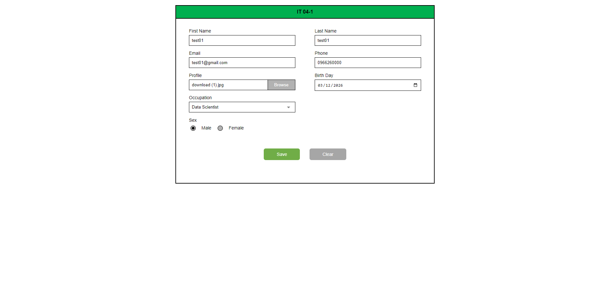

# IT 04-1 Registration System

This repository contains a full-stack Registration application built with **.NET 8.0** and **Angular 18**, backed by **Microsoft SQL Server**. It implements a complete user registration flow matching the **IT 04-1** requirement specification, complete with data validation, profile image uploads, and asynchronous anti-duplication checks.

---

## 📸 Features

The following functionalities are implemented using Angular Standalone Components + .NET 8 API:

### 1. User Registration (IT 04-1 Form)
A dynamic, responsive form for collecting user data including Name, Email, Phone, Birth Day, Occupation, and Sex.
* **Strict Validation:** Validates required fields, email format, and specific phone number lengths (9-10 digits).
* **Profile Upload:** Supports image attachment with real-time base64 encoding and 5MB size limit validation to secure the backend API.
* **Async Email Checking:** Validates against the backend database in real-time to prevent duplicate email registrations before form submission.



### 2. Success Notification (IT 04-2 View)
Upon successful registration, the form smoothly resets and displays a temporary floating success banner with the generated database ID (e.g., `save data success Id : 00001`). The notification automatically hides after 5 seconds using Angular's NgZone timeout tracking.

---

## Project Structure

```
RegisterIT0401-be/
├── RegisterIT0401/          # .NET 8.0 API Project (Controllers, Services, Models)
└── DAL/                     # Class Library for EF Core (Entities and DbContext)

RegisterIT0401-fe/           # Angular 18 Frontend Application
```

### Details

1. **RegisterIT0401 (API Project)**
   * Backend implemented in **.NET 8.0**.
   * Exposes endpoints for user registration (`POST /api/users`) and validation (`GET /api/users/check-email`).
   * References `DAL` class library for database access.
   * Uses Swagger/OpenAPI for API documentation.

2. **RegisterIT0401.Tests**
   * Unit tests for the backend API controllers and dependency injection resolver.
   * Ensures reliability of registration business rules.

3. **DAL (Data Access Layer)**
   * Class library containing **Entity Framework Core 8** `AppDbContext` and the `User` domain entity.
   * Encapsulates database operations for modularity.

4. **RegisterIT0401-fe (Angular)**
   * SPA frontend for the user registration system built with Angular Standalone Components.
   * Uses:
     * `@angular/forms` (Reactive Forms)
     * `rxjs` patterns (Observables, AsyncValidators, debounce algorithms)
     * Real-time file processing `FileReader` API

---

## Technologies

* **Backend:** .NET 8.0, C# 12
* **Frontend:** Angular 18, TypeScript, RxJS
* **Database:** Microsoft SQL Server (via Docker)
* **ORM:** Entity Framework Core 8.0

---

## Setup Instructions

### Prerequisites
* [.NET 8 SDK](https://dotnet.microsoft.com/download/dotnet/8.0)
* [Node.js](https://nodejs.org/) (v18 or later recommended)
* SQL Server (LocalDB, Express, or Docker container instance listening on port 14333)

### Backend (.NET)

1. Open the backend solution in Visual Studio 2022 / JetBrains Rider / VS Code.
2. Navigate to the backend application directory:
   ```bash
   cd RegisterIT0401/RegisterIT0401-be/RegisterIT0401
   ```
3. Restore NuGet packages and run:
   ```bash
   dotnet restore
   dotnet run
   ```
   *Note: Ensure the SQL server connection string inside `appsettings.json` points to your active database instance.*

### Frontend (Angular)

1. Navigate to the frontend directory:
   ```bash
   cd RegisterIT0401/RegisterIT0401-fe
   ```
2. Install dependencies:
   ```bash
   npm install
   ```
3. Run the Angular development server:
   ```bash
   npm start
   ```
4. Access the application in your browser at `http://localhost:4200`
